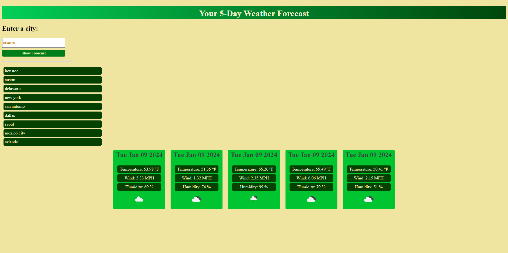

# Weather Forecast App

## Description
This simple web app takes in user input of a city and gives back a 5 day forecast! You get to see humidity, wind, temperature, date, and an icon for conditions! It'll also save your past searches in case you want to check back in.

## Motivation
I wanted to have a better understanding of how to use server side APIs and in a practical way. There are lots of apps that integrate weather in some way, so it's an extra plus to learning API integration in general.

## Table of Contents
- [Installation](#installation)
- [Usage](#usage)
- [Credits](#credits)
- [License](#licenses)
- [Questions](#questions)

## Installation
Fork or clone the repository into your own computer and open in your preferred IDE and open the index.html in your preferred browser!

## Usage
Just enter the name of a city into the search bar and click "Show Forecast". Your weather will then append to the page. You can refresh or leave the page and your past searches will still show up.

## Credits
https://openweathermap.org/forecast5 - 5 Day Forecast OPENWEATHER Docs  
https://codedamn.com/news/javascript/how-to-fix-typeerror-converting-circular-structure-to-json-in-js - Trouble with circular structure and JSON    
https://blog.logrocket.com/localstorage-javascript-complete-guide/#:~:text=getItem()%20allows%20you%20to,the%20value%20as%20a%20string. - Local Storage Help  
https://coding-boot-camp.github.io/full-stack/apis/how-to-use-api-keys - Initial API Setup

## Licenses
This project is covered by the MIT license.

## Questions 
If you have any questions or would like to reach out for any reason, please feel free!
My Email: barrettg516@gmail.com

Github: g-barrett (https://github.com/g-barrett)
